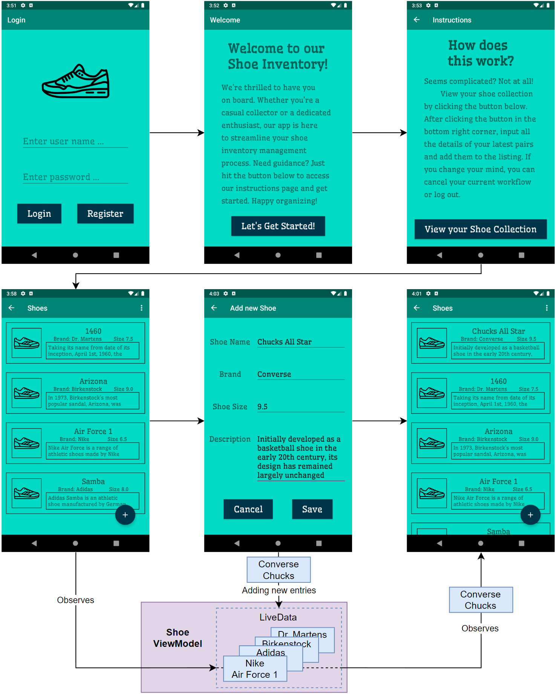

# Shoe Inventory App

This Android app demonstrates the MVVM development pattern using a single activity inventory management system for shoes.

## Technical Requirements
```
- Tested on Android Studio on Pixel 2 Emulator
- API Version 28
- Compile Sdk 33
```
## Udacity project submission
This project additionally serves as a submission for the Udacity Nanodegree "Android Kotlin Developer"
<details xmlns="http://www.w3.org/1999/html">
  
<summary><b>Fulfillment of requirements</b></summary>

<h3>Code Quality</h3>
<blockquote>
<li> <cite>"Correctly use ViewModel and LiveData lifecycle classes in an Android app"</cite> </li>
<li> <cite>"Correctly implement Single Activity architecture." </li>
<li> <cite>"Write error-free codee."</cite> </li>
</blockquote>

<h3>Layouts</h3>
<blockquote>
<li> <cite>"Create layouts using the correct ViewGroups and Views in an Android app."</cite> </li>
<li> <cite>"Apply Databinding in Layouts to show the correct data to users in multiple layouts." </li>
<li> <cite>"Correctly use the and elements within the layout."</cite> </li>
<li> <cite>"Create a multi-screened Android Application using Android widgets."</cite> </li>
<li> <cite>"List screen uses ScrollView and LinearLayout for showing a list of items and one Floating Action button for going to the detail screen. Creates a layout for the item."</cite> </li>
<li> <cite>"Create a detail screen that shows two columns of labels and edit views to enter in a new item."</cite> </li>
<li>
</blockquote>

<h3>Navigation</h3>
<blockquote>
<li> <cite>"Create a navigation file that correctly takes a user from one page to the next in an Android app"</cite> </li>
<li> <cite>"Use Databinding for click listeners on a navigation screen in an Android app." </li>
<li> <cite>"Create a Logout menu to return to the Login screen."</cite> </li>
</blockquote>


</details>

## Basic Workflow




## Sources
- Sneaker icons taken from https://www.svgrepo.com
- Animation snippets taken from [Udactiy "Guess It" App](https://github.com/udacity/andfun-kotlin-guess-it)
